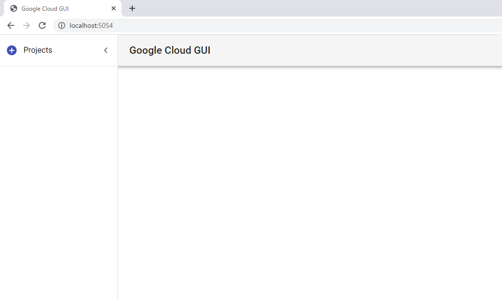
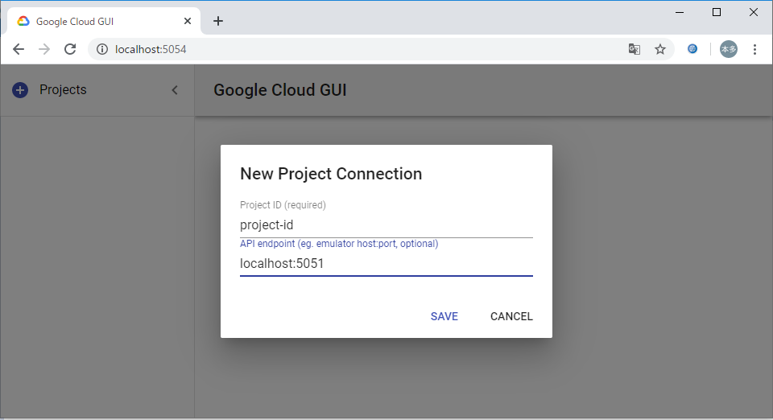
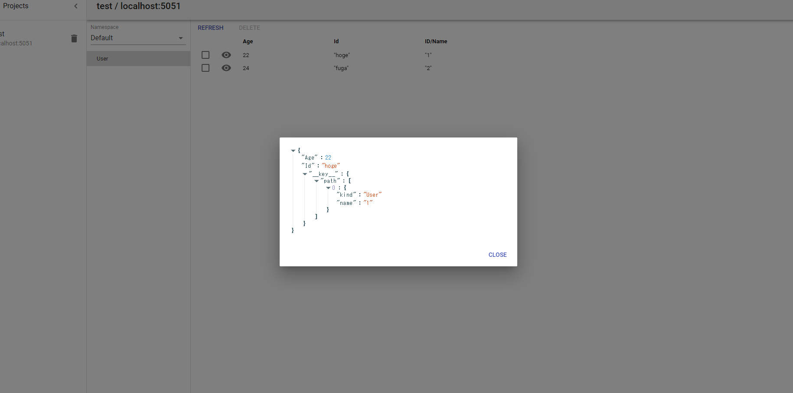
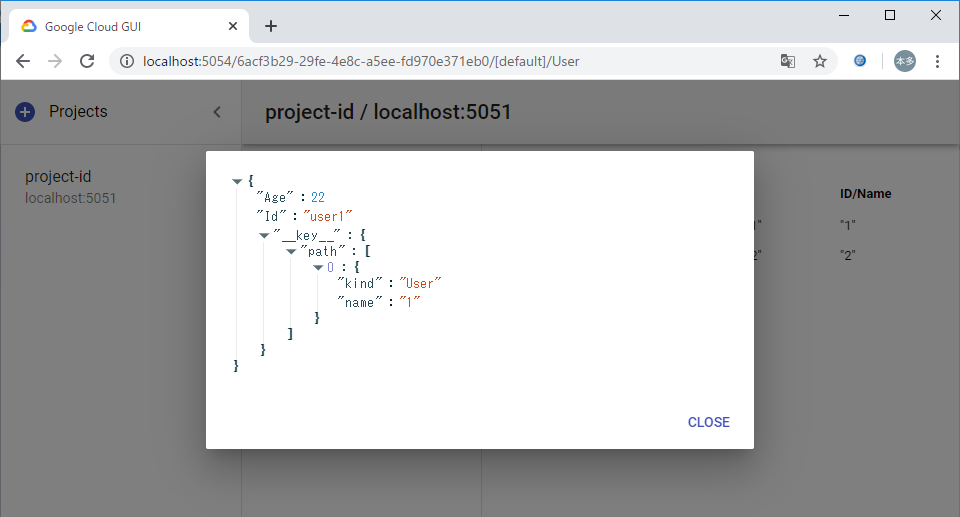

# giglocal - A partly functional local GCP

*giglocal* provides an easy-to-use and integrated GCP testing environment.


## Overview

GCP 用のエミュレータは公式のもの(https://cloud.google.com/sdk/gcloud/reference/beta/emulators)や 3rd party 製のものなどいくつか存在するが、各アプリケーションごとに独立している。これらを一元的に管理して使いやすいような環境を、Docker コンテナ上で再現できるように提供します。

現在サポートしているアプリケーション：

* **Datastore** 
  * **Google Cloud GUI**
* **Firestore** 
* **Pub/Sub** 

... In the future, more...

## Requirements
* `Docker`
* [Cloud Client Libraries](https://cloud.google.com/apis/docs/client-libraries-explained) (for language you want to use)

*Datastore*
## QuickStart

本リポジトリを clone して以下のコマンドで docker コンテナを立ち上げます。
```bash
docker-compose up
```

コンテナの立ち上げ後は以下のポートを通じて各エミュレータに接続することができます。

|Emulator         | Default port          | Service Name      |SERVICE            |
|-----------------|-----------------------|-------------------|-------------------|
|Datastore        | http://localhost:5051 | datastore         | DATASTORE         |
|Firestore        | http://localhost:5052 | firestore         | FIRESTORE         |
|Pub/Sub          | http://localhost:5053 | pubsub            | PUBSUB            |
|Google Cloud GUI | http://localhost:5054 | google-cloud-gui  | Google Cloud GUI  |


環境変数で `<SERVICE>_EMULATOR_HOST` を指定することで gcloud の向き先をエミュレータにすることができます．

```bash
export DATASTORE_EMULATOR_HOST=localhost:5051
export FIRESTORE_EMULATOR_HOST=localhost:5052
export PUBSUB_EMULATOR_HOST=localhost:5053
```

詳細は以下を参照ください。

- datastore : https://cloud.google.com/sdk/gcloud/reference/beta/emulators/datastore
- firestore : https://cloud.google.com/sdk/gcloud/reference/beta/emulators/firestore
- pubsub : https://cloud.google.com/sdk/gcloud/reference/beta/emulators/pubsub 

### [Google Cloud GUI](https://github.com/GabiAxel/google-cloud-gui)
Google Cloud GUIは Datastore エミュレータの中身をGUIで確認できるオープンソースのツールです。

デフォルトではブラウザ上で http://localhost:5054 にアクセスすることで、
このようなページが開かれます。



左上の「＋Projects」をクリックし、プロジェクト名とDatastoreのホストを入力します。



Datastoreエミュレータに保存されている内容を確認することができます。





## Configurations

環境変数から以下のような設定をすることができる．

* `SERVICES`: カンマ区切りでサービス名を指定することで，起動するエミュレータを指定できる．\
指定しなかった場合全てのエミュレータが起動される．
  > 例1: `SERVICES="datastore,pubsub"` -> datastore, pubsub が起動し，firestore, google-cloud-gui は起動しない 

  (google-cloud-guiはdatastoreとgoogle-cloud-guiの両方を指定したときのみ起動する)
* `<SERVICE>_PORT`: 各エミュレータを起動する際に割り当てるポート番号を指定できる．\
指定しなかった場合，default port が割り当てられる．
* `<SERVICE>_DIR`:  各エミュレータのローカルデータをマウントするディレクトリを指定できる．\
指定しなかった場合デフォルト値 (`./src/<service name>/.data`) が指定される\
この設定は v0.1.0 現在 Datastore, Pub/Sub のみ指定ができる．


## Change Log
* v0.1.0: Initial release

## License
This version of giglocal is released under the Apache License, Version 2.0 (see [LICENSE](https://github.com/future-architect/giglocal/blob/master/LICENSE)).
